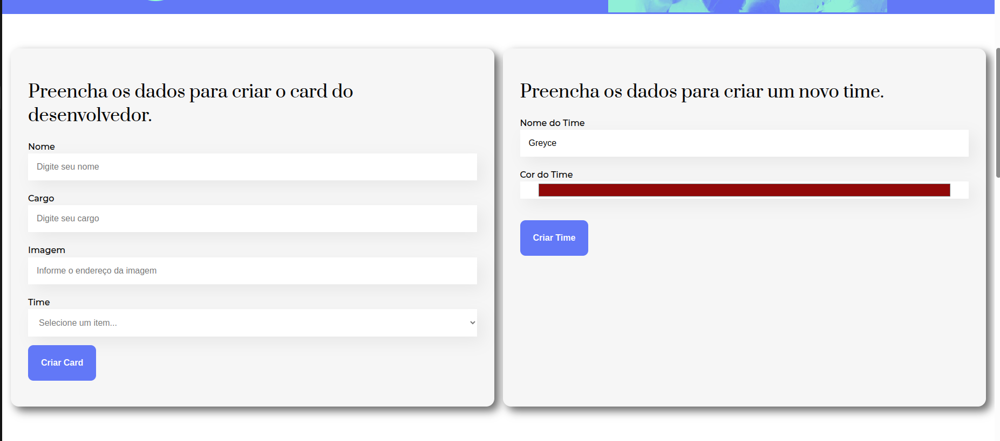
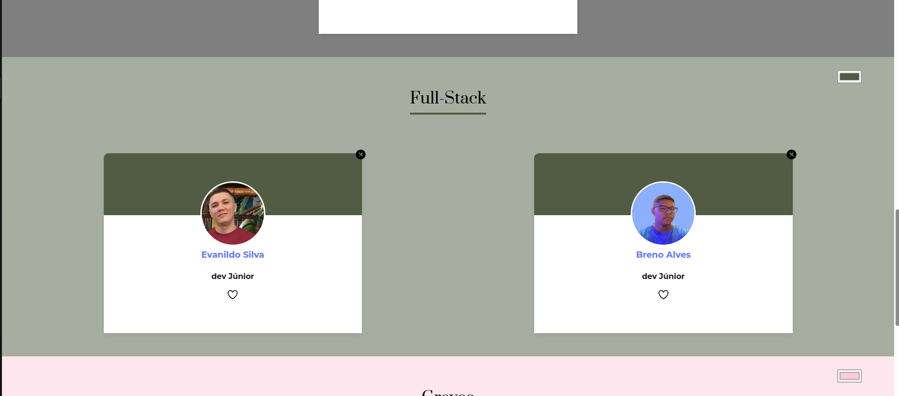

## Organo-web

Esse projeto web chamado organo tem como objetivo, organização dos times de desenvolvimento por categorias, são elas: 

Front-End
Back-End
Full-Stack
DevOps
Mobile
Designer & UX   

O usuário pode adicionar os desenvolvedores, separando-os por categoria, e caso seja preciso criar uma nova categoria, o usuário poderá adicionar facilmente.

Logo abaixo irá aparecer os desenvolvedores adicionados e separados por categoria. 
O usuário poderá, apagar ou favoritar um ou mais desenvolvedor caso assim deseja.

### Telas Desktop





### Link do site

```bash
https://organo-umber-zeta.vercel.app/
```

### para criação do projeto-react

```bash
npx create-react-app 
```

